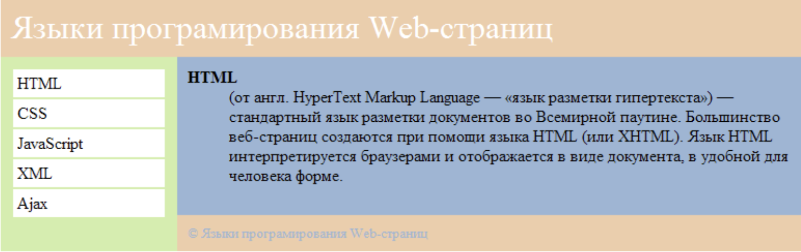
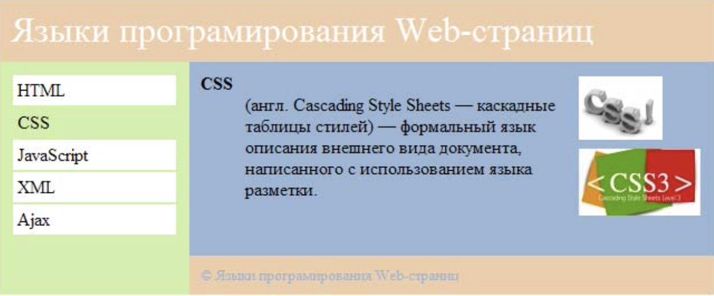
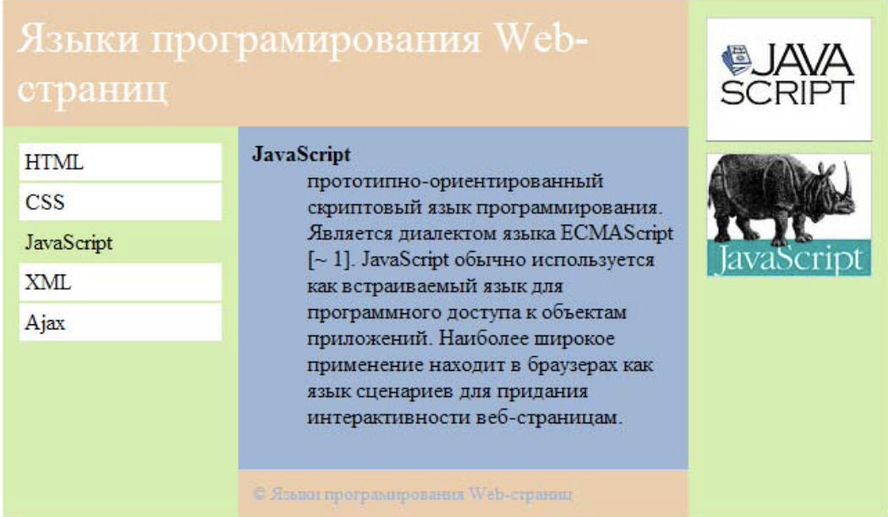

# Задания для самостоятельной работы по теме No2

## Самостоятельная работа No1. Создание страницы html на основе таблицы.

Создайте новый html файл и сохраните его под именем **family_SRSWEB_2_1.html**

Создайте страницу, как на рисунке ниже.

Форма должна включать в себя следующие элементы:

## Самостоятельная работа No2. Создание страницы html на основе таблицы.

Создайте новый html файл и сохраните его под именем **family_SRSWEB_2_2.html**

Создайте страницу, как на рисунке ниже. Во вложенной таблице справа используются изображения **css.jpg** и **css3.jpg**.

## Самостоятельная работа No3. Создание страницы html на основе таблицы.

Создайте новый html файл и сохраните его под именем **family_SRSWEB_2_3.html**

Создайте страницу, как на рисунке ниже. Во вложенной таблице справа используются изображения **javascript.jpg** и **javascript2.jpg**.

## Самостоятельная работа No4. Объединение страниц ссылками.

Объедините файлы **family_SRSWEB_2_1.html**, **family_SRSWEB_2_2.html** и **family_SRSWEB_2_3.html** ссылками.

Выполненные задания добавьте в архив. Назовите архив **family_SRSWEB_2**, где **fаmilу** ваша фамилия в английской транскрипции. Полученный архив вышлите преподавателю.