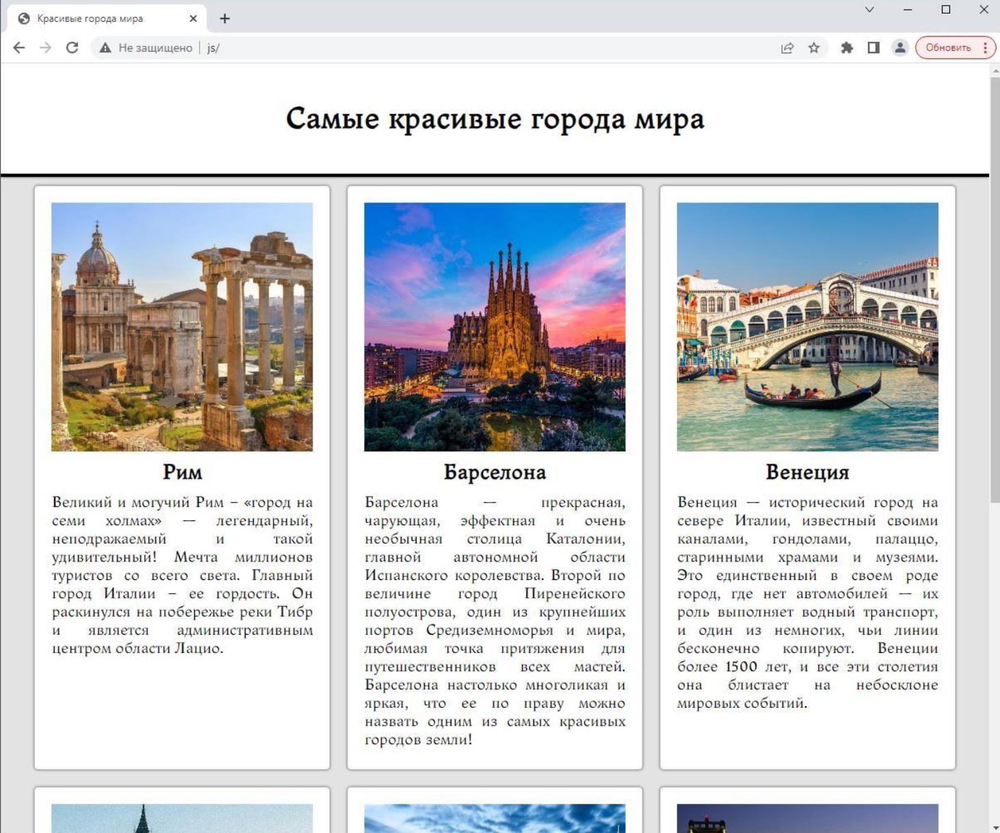

# Манипулирование узлами DOM 

## Создание галереи "Самые красивые города мира"

В директории раздаточного материала вам предложены исходные файлы для выполнения практической работы. Ваша задача - динамическое создание блоков, содержащих данные о городах галереи "Самые красивые города мира".

Откройте файл `index.html`, выполните следующий набор действий:

- подключите файл стилей (`style.css`);
- подключите файл с данными (`data.js`);
- используя представленную в комментарии структуру (шаблон), создайте
первый блок города;
- последующие блоки городов получите клонированием от первого;
- используя данные объекта из файла `data.js` вставьте контент для
каждого созданного блока;
- вставьте в целевой блок `
` созданный контент.

Результат выполнения задания продемонстрирован на рисунке.

P.S. Метод `insertAdjacentHTML` - прекрасный способ добавления узлов, но в учебных целях постарайтесь в данной работе его не применять. Он очень сильно упрощает задачу, а наша главная цель не выполнить работу, а научиться манипулировать узлами.

